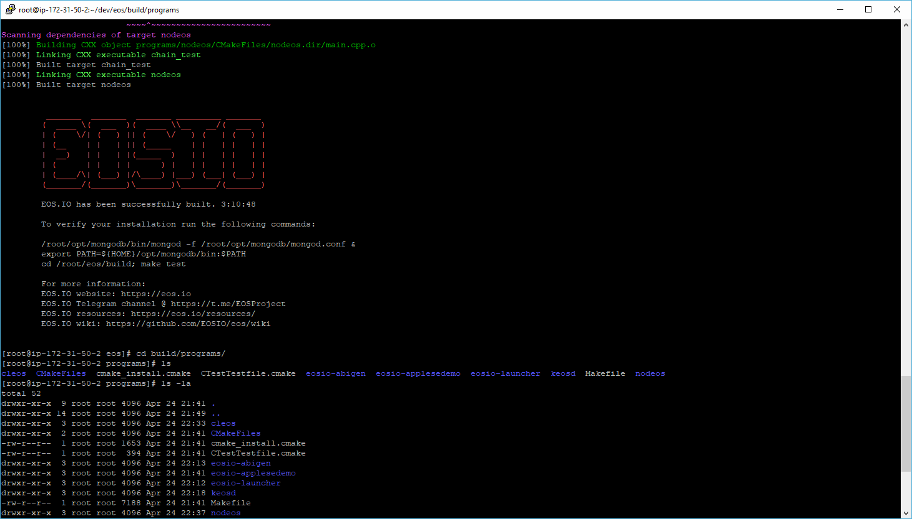

### Introduction

It's possible to compile the EOS software on almost every platform. We're going to be using an AWS instance as most people will have the ability to create an AWS account and follow along. 

The official page has a lot more detail. If you'd like to compile it on your own machine, follow the instructions [HERE](https://github.com/EOSIO/eos/wiki/Local-Environment#2-building-eosio)

#### Compiling the EOS software

{}
Compiling the EOS software takes about 3 hours on a AWS t2.large instance. 
{}


```
sudo su
yum update
yum install git
```


```
sudo su
mkdir dev
cd dev/
git clone https://github.com/EOSIO/eos --recursive
cd eos/
./eosio_build.sh

```

Here's what you should see when process completes about 3 hours later. 


```
cd build/
make install
```

```
cd build/programs/nodeos
./nodeos -e -p eosio --plugin eosio::wallet_api_plugin --plugin eosio::chain_api_plugin --plugin eosio::account_history_api_plugin 
```

In another terminal window check that you can get the server info
```
curl http://127.0.0.1:8888/v1/chain/get_info
```

In most cases we'll want to be able to connect to that URL remotly so we'll need to update the .INI (config file)
{}
If you have not run the above ./nodeos ... statement the below ~/.local folder will not yet exist
{}

```
vi ~/.local/share/eosio/nodeos/config/config.ini

#Edit the following line:
http-server-address = 127.0.0.1:8888

#To look as follows
http-server-address = 0.0.0.0:8888
```

You can now go to server http://{Your Server URL}:8888/v1/chain/get_info

Example:
http://ec2-35-171-26-29.compute-1.amazonaws.com:8888/v1/chain/get_info

The response will be some JSON that looks something like this:
```
{
  "head_block_id": "0000030958e04a60a886d7eaec578eb438980b6feaf7c65a65a1609bc2eacb97",
  "head_block_num": 777,
  "head_block_producer": "eosio",
  "head_block_time": "2018-04-25T02:05:51",
  "last_irreversible_block_num": 776,
  "server_version": "dead9cef"
}
```

The same thing can be achieved using the cleos tool whcih can be found in the eos/build/programs/cleos folder. 

cleos -H ${nodeos_host} -p ${nodeos_port} get info
```
./cleos -H 127.0.0.1 -p 8888 get info
```

